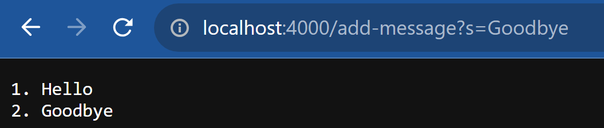
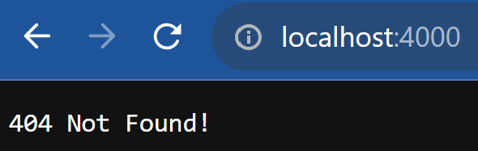

# Lab Report 2 - Servers and SSH Keys (Week 3)

## Part 1



- Which methods in your code are called?
  - The `handleRequest` method is called
- What are the relevant arguments to those methods, and the values of any relevant fields of the class?
  - The URI `http://localhost:4000/add-message?s=Goodbye` is the only argument
  - At the point of the request, the `history` field would be

  ```plaintext
  1. Hello
  ```

  - The `num` field would be `2`
- How do the values of any relevant fields of the class change from this specific request? If no values got changed, explain why.
  - This request would add the word "Goodbye", so the new `history` field would be

  ```plaintext
  1. Hello
  2. Goodbye
  ```
  
  - The `num` field would change to `3`



- Which methods in your code are called?
  - The `handleRequest` method is called
- What are the relevant arguments to those methods, and the values of any relevant fields of the class?
  - The URI `http://localhost:4000` is the only argument
  - At the point of the request, the `history` field would be

  ```plaintext
  1. Hello
  2. Goodbye
  ```

  - The `num` field would be `3`
- How do the values of any relevant fields of the class change from this specific request? If no values got changed, explain why.
  - No values would change because it's an invalid URL

## Part 2

```bash
PS C:\Users\paksh\.ssh> ls


    Directory: C:\Users\paksh\.ssh


Mode                 LastWriteTime         Length Name
----                 -------------         ------ ----
-a----         10/5/2022  12:58 am             69 config
-a----          8/5/2022   9:06 pm            399 id_ed25519
-a----          8/5/2022   9:06 pm             89 id_ed25519.pub
-a----         10/5/2022  12:33 am           3389 id_rsa
-a----         10/5/2022  12:33 am            749 id_rsa.pub
-a----        17/10/2023  12:22 pm           1369 known_hosts
-a----         10/5/2022  12:40 am            276 known_hosts.old
-a----         14/5/2022  10:36 pm           1458 privkey.ppk
-a----         14/5/2022  10:36 pm            477 pubkey
```

The path to my private key is `C:\Users\paksh\.ssh\id_rsa` and the path to my public key is `C:\Users\paksh\.ssh\id_rsa.pub`

### Logging in to ieng6 without needing a password

```bash
PS C:\Users\paksh\.ssh> ssh cs15lfa23lq@ieng6.ucsd.edu
Last login: Sat Jun 10 14:49:38 2023 from 128.54.208.50
quota: Cannot resolve mountpoint path /home/linux/staff/.snapshot/hourly.2023-10-03_0801: Stale file handle
Hello cs15lfa23lq, you are currently logged into ieng6-201.ucsd.edu

You are using 0% CPU on this system

Cluster Status 
Hostname     Time    #Users  Load  Averages  
ieng6-201   13:40:01   12  2.31,  2.09,  2.00
ieng6-202   13:40:01   7   1.73,  0.64,  0.35
ieng6-203   13:40:01   7   0.43,  0.28,  0.25

 
Tue Oct 17, 2023  1:42pm - Prepping cs15lfa23
[cs15lfa23lq@ieng6-201]:~:17$
```

## Part 3

One thing I learned was that the `scp` command can be used to copy files from one computer to another. This is useful because it allows me to transfer files between my computer and the ieng6 server. Another thing I learned was that the `ssh` command can be used to log into a remote server. This is useful because it allows me to access the ieng6 server from my computer. The last thing I learned was that the `ssh-keygen` command can be used to generate a public and private key pair. This is useful because it allows me to log into the ieng6 server without needing to enter a password.
